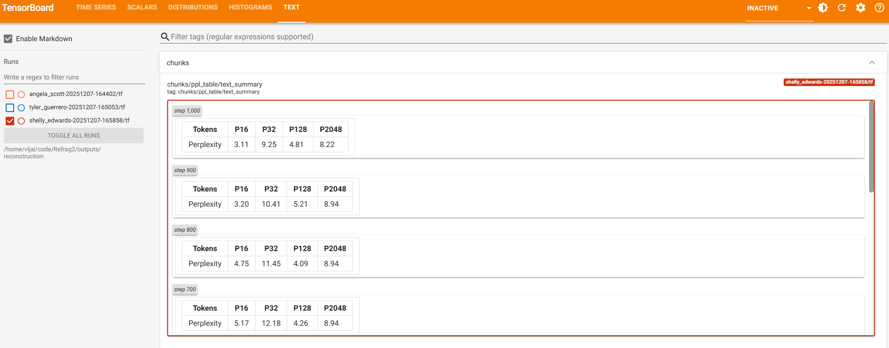

# Reconstruction Task Guide

This doc covers how to run the reconstruction curriculum (Table 11/12 in the Refrag paper) and how to use the local RedPajama sample for quick smoke tests.

## Prereqs
- Activate the `refrag` venv.
- Export a valid HF token: `export HF_TOKEN=...`
- For GPU: ensure CUDA is available and set `device=cuda` in the command.

## Full paper setup (SlimPajama, ArXiv + Books3)
```bash
HYDRA_FULL_ERROR=1 \
python run.py app=reconstruction device=cuda
```
Defaults pull SlimPajama (`cerebras/SlimPajama-627B`), filter on `pile_set_name`, and use the Table 11/12 curriculum.

## Quick local sample (RedPajama shards)
1) Generate a small 50/50 ArXiv/Books sample (writes to `redpajama_1b_sample`):
```bash
python sample_redpajama.py
```
2) Run reconstruction against the local shards via the JSON loader:
```bash
HYDRA_FULL_ERROR=1 \
python run.py app=reconstruction device=cuda \
  app.dataset.name=json \
  app.dataset.data_files="$(pwd)/redpajama_1b_sample/shard_*.jsonl" \
  app.dataset.split=train \
  app.dataset.filter_field=null
```

## TensorBoard
Logs live under the Hydra run dir (`outputs/.../tf`). Launch:
```bash
tensorboard --logdir outputs
```
Key groups: `reconstruction/*` for losses and throughput, `chunks/*` for chunk-level perplexity/histograms, and `reconstruction/examples` for sample text tables.

### Screenshot from runs for reconstruction task

#### Console log sample


#### Scalars overview


#### Chunk reconstructions in text tab


#### Text samples table (similar to Refrag Paper Table 12)

